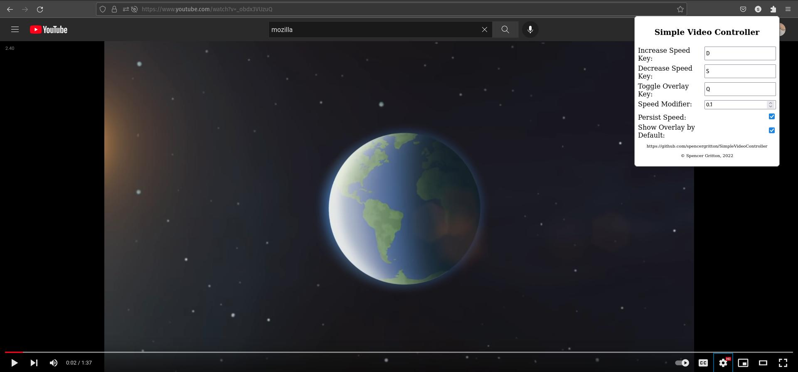

# Simple Video Controller

The desire for this project was to create a simple, easily auditable, and maintainable HTML video speed controller.

# Typical Installation

For Firefox, go to https://addons.mozilla.org/firefox/addon/simple-video-controller/

# Manual Installation

This is currently more difficult than it should be because I haven't bothered to add this to the Chrome Web Store.

Steps:

1. Clone this repo
2. Navigate to `chrome://extensions/` in Chrome or `about:debugging#/runtime/this-firefox` in Firefox
3. Click "Load Unpacked" (Chrome) or "Load Temporary Add-on" Firefox
4. Click the manifest.json inside either Chrome or Firefox folder of the plugins repo
5. Success!
6. Note to self, make this easier in the future

# Current Functionality

-   Set hotkeys to control video speed
-   Show or hide current video speed (also hotkey-able)
-   Set a persistent speed which will carry through videos (WIP)
-   Change speed modifier (default 0.1x)
-   Plugin is 486 lines of code, meaning most novice developers should be able to audit it without much trouble

# Future Goals

-   Add Firefox Compatibility (Alpha)
-   Publish on Chrome Web Store
-   Add hotkeys for speed pre-sets
-   Create logo
-   Improve popup menu styling
-   Improve plugin wording
-   Do bug fixes (Not a priority given only I use this plugin at the moment)

# Known Bugs
-   Youtube videos will at times swap back to default speed (issue with youtube resetting speed to 1 after plugin sets speed)
-   Youtube videos will at times speed up/down multiple times per key press (must be issue with listener creation)
-   Popup is sometimes too small
-   Some websites don't work properly (will compile a list once this becomes a priority)

# Inspiration

The hugely popular [Video Speed Controller](https://github.com/igrigorik/videospeed) was the inspiration for this project. I'm a big fan of the plugin and had been using it for years before writing this.
